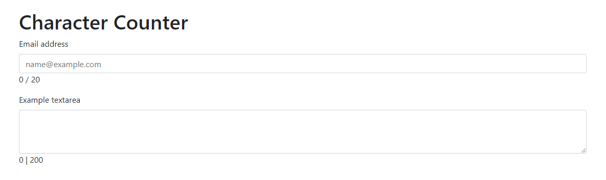

   <h1>jQuery Character Counter</h1>
   <h4>A jQuery based character counter for &lt;input&gt; and &lt;textarea&gt; HTML tags.</h4>
   
   

   

     <h4>What is this?</h4>
      
This simple plugin allows you to add a character counter to any &lt;input&gt; or &lt;textarea&gt; tag on your web-site with jQuery.

       <h4>Installation</h4>
       
Just add the "charCounter.js" or "charCounter.min.js" to your web-page through the &lt;script&gt; tag.

       <h4>How do I use it?</h4>
        
Easy.

        <blockquote>
            $(element).charCounter({ options });
        </blockquote>
        
That's it.

              <h4>Options</h4>
        
<b>customClass</b>

        
Default: none. Allows you to customize your character counter with CSS. You can style it like a &lt;p&gt; HTML element.

       <blockquote>
            

                //CSS
            

            
.style-for-counter{color: 'red'; font-size: 24pt;}

            
//jQuery

            
$(element).charCounter({ customClass: "style-for-counter" });

        </blockquote>
        
<b>Divider</b>

        
Default: 'slash'. Accepts: 'slash', 'dash' and 'bar. Changes character counter divider symbol ("/", "-" or "|")

        <h4>fontSize</h4>
        
Default: '1rem'. Changes font size for the character counter.

        

        
This plugin and its source code are free to use.

   

